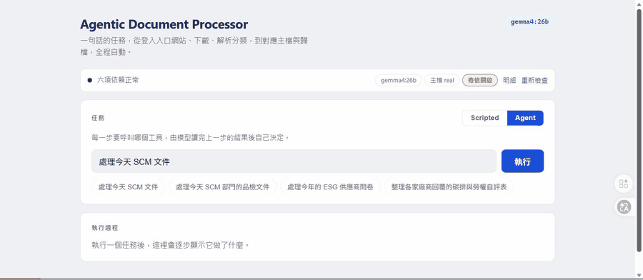
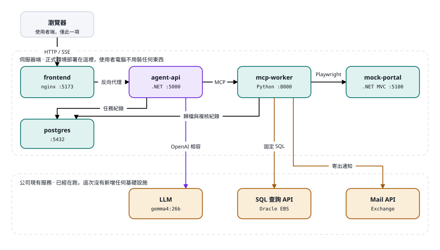
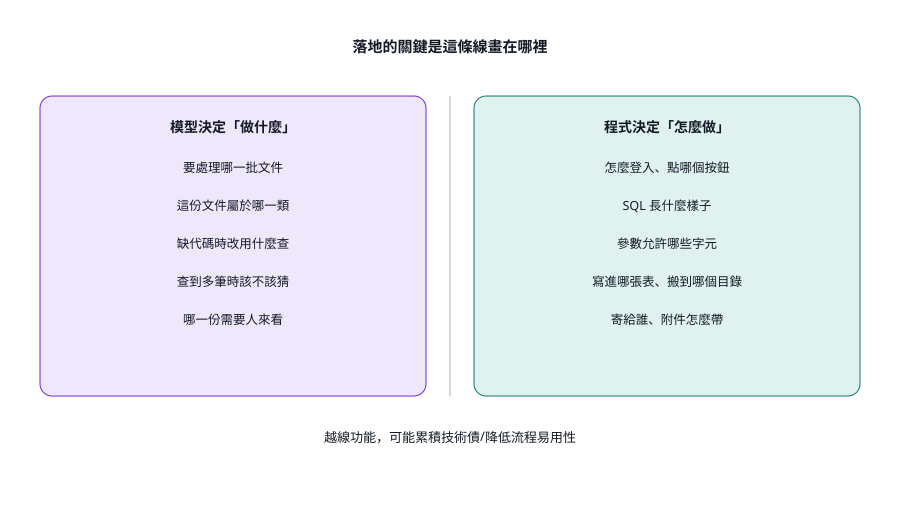
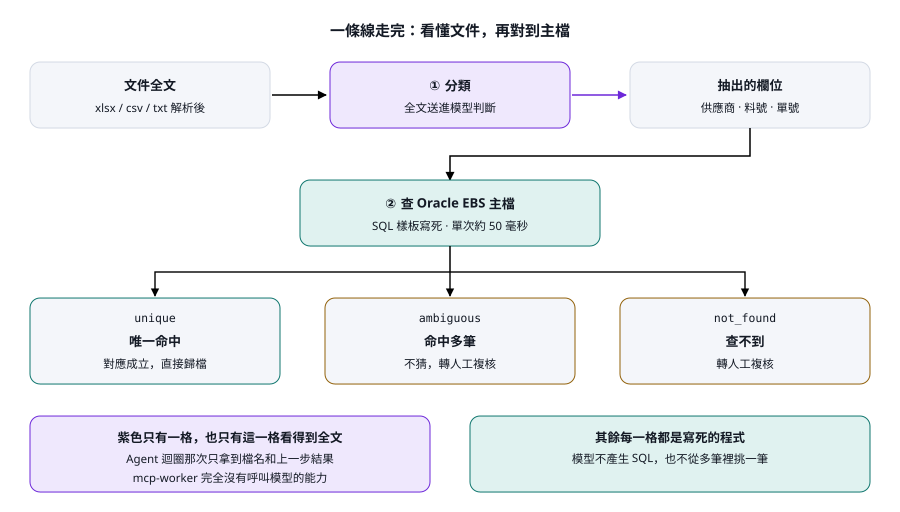
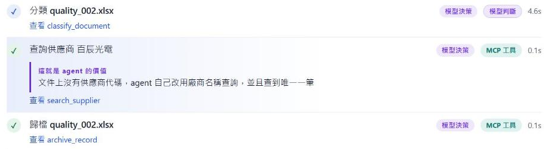
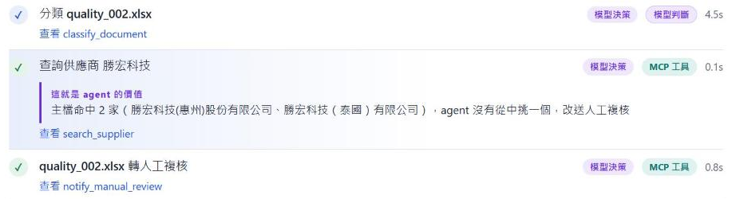
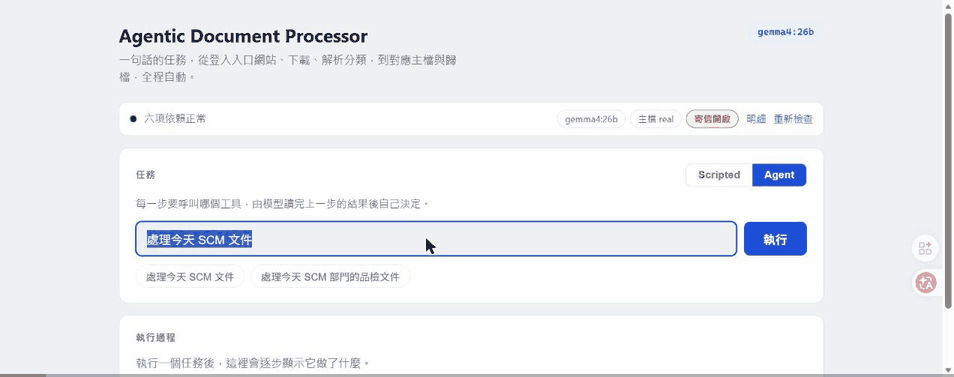
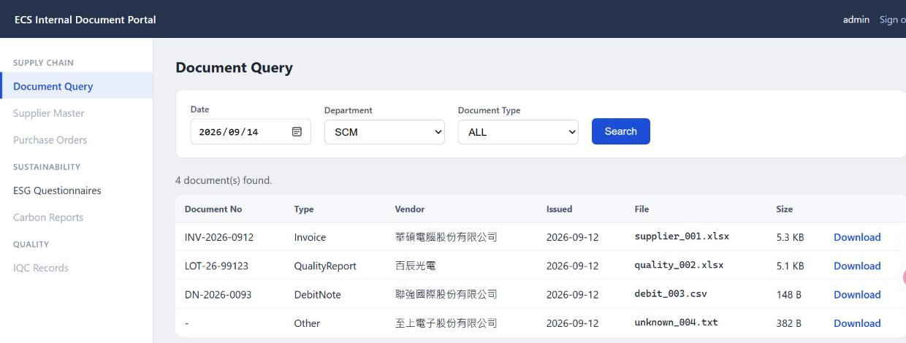
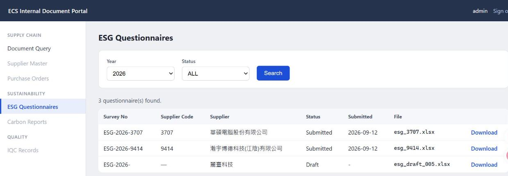
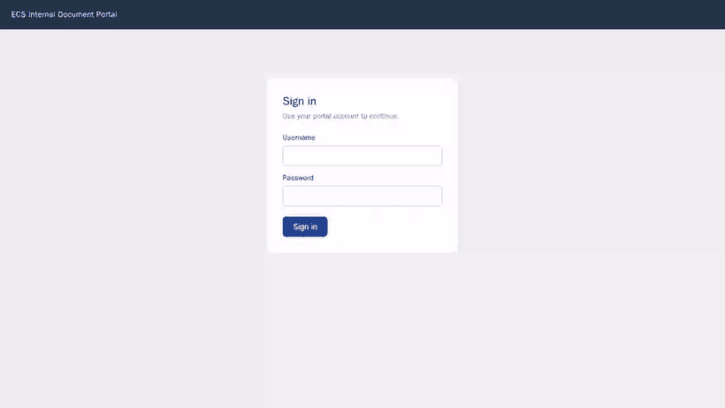

# Agentic Document Processing Demo

功能demo：使用者用自然語言下一個任務，agent 自己登入入口
網站、下載文件、解析分類、對應 ERP 主檔、歸檔，處理不了的送人工複核。

重點不是「AI 很厲害」，而是把一條原本會在第一個例外就停住的自動化流程，
換成**遇到例外會自己想辦法、但知道什麼時候不該亂猜**的做法。



上面是一次完整執行的錄影：Agent 模式、一句「處理今天 SCM 文件」，取得 4 份文件，
3 份歸檔、1 份轉人工複核，全程 49 秒。現場 demo 出狀況時直接放它，`docs/media/agent-run-fallback.gif`。

四份模擬文件刻意各走不同的路：一張乾淨的供應商發票、一份只寫廠商名稱沒有代碼的
品檢報告、一張 debit note CSV、一個沒有結構的純文字檔。

---

## 快速開始

需要 Docker Desktop、PowerShell 7、Python 3（只用來跑輔助腳本）。

```powershell
cp .env.example .env      # 填入 LLM API key 與 AD 帳密
docker compose up -d
./scripts/reset-demo.ps1
```

| 位址 | 用途 |
|---|---|
| http://localhost:5173 | Agent 主控台，展示時開這個 |
| http://localhost:5100 | 模擬入口網站，帳號 `admin` 密碼 `123456` |
| http://localhost:5000/api/health/services | 六項依賴的健康檢查 |

### 環境變數

完整清單看 `.env.example`。展示時最常動的三個：

| 變數 | 值 | 預設 | 用途 |
|---|---|---|---|
| `AGENT_MODE` | `scripted` \| `llm` | `scripted` | 主控台可以直接切 |
| `DBQUERY_MODE` | `mock` \| `real` | `real` | 主檔查 PostgreSQL 還是 Oracle EBS |
| `MAIL_ENABLED` | `false` \| `true` | `false` | 人工複核要不要真的寄信 |

`.env` 含 API key 與 AD 密碼，已在 `.gitignore` 裡，不要提交。
註解要自己一行，行尾的 `# ...` 會被吃進值裡。

`MAIL_ENABLED=true` 時人工複核會真的寄出郵件，收件者是 `.env` 裡的 `MAIL_TO`。
彩排前想安靜一點就把它關掉。改完 `.env` 之後兩個服務都要重啟，否則其中一個會拿著
舊的開關：

```powershell
docker compose up -d agent-api mcp-worker
```

---

## 架構

五個自建容器，三個公司既有的內部服務。



紫色是模型做的決定，藍綠色是程式執行，橘色是公司既有的服務。虛線框住的上半部
在伺服器上，使用者電腦只有瀏覽器。

- **agent-api**（.NET）Agent 迴圈、LLM 呼叫、文件分類、任務狀態。
- **mcp-worker**（Python）所有工具的實作。帳號密碼只存在這個行程裡。
- **mock-portal**（.NET MVC）模擬的企業入口網站，兩個分頁：SCM 文件、ESG 問卷。
- **frontend**（React）主控台，執行軌跡即時串流。
- **postgres** 任務、軌跡、分類與對應歷程、歸檔結果。

正式環境只有瀏覽器跑在使用者端，其餘都在伺服器上。Docker 是這個 demo 的方便，
不是架構本身。

這條線是整個專案的前提：



---

## 這個 demo 展示什麼

同一批文件、同一句任務，兩種模式：

| | Scripted（順序寫死） | Agent（模型決定） |
|---|---|---|
| 「處理今天 SCM 文件」 | 2 份歸檔、2 份人工複核 | 3 份歸檔、1 份人工複核 |
| `quality_002.xlsx`（只有廠商名稱） | 人工複核：沒有供應商代碼 | 自己改用名稱查 ERP，查到 1 筆就歸檔 |
| 名稱在 ERP 命中 2 筆時 | 同上，一樣進人工複核 | 不挑，轉人工複核並附上兩個候選 |
| 「整理各家廠商回覆的碳排與勞權自評表」 | 關鍵字沒中，抓錯分頁去拿 SCM 文件 | 讀得懂意思，去拿 ESG 問卷 |

差別不在工具，兩邊呼叫的是同一組 MCP 工具；差別在誰決定下一步。

每一份文件都走這條線，分歧只在最後一格：



第二列的那一步長這樣——文件上沒有代碼，模型自己改用名稱查，查到唯一一筆就繼續歸檔：



第三列是同一份文件、同一個模型，只是名稱在 ERP 命中兩家。它沒有挑一個：



兩種結果都對。資料支持判斷時它自己接下去，不支持時它停下來。歧義情境用
`./scripts/reset-demo.ps1 -Ambiguous` 打開，換掉的是文件上印的廠商名稱，不是資料庫。

最後一列問的不是文件，而是「要去哪個分頁拿」。同一句「整理各家廠商回覆的碳排與
勞權自評表」，Scripted 的關鍵字規則沒有命中，照樣去抓 SCM 文件；Agent 讀出這是
ESG，去了問卷那個分頁：



前半段是 Scripted，第二步就寫著「從入口網站取得今天的 SCM 文件」；後半段是 Agent，
第二步變成「下載 ESG 問卷」，旁邊附上它的判斷理由。兩段都是實跑，沒有剪接。

## agent 面對的網站

模擬的企業入口網站（`http://localhost:5100`，帳號 `admin` 密碼 `123456`）。
登入、選條件、按查詢、逐份下載，都是 Playwright 實際操作，agent 看不到任何選擇器。

左邊選單是兩個不同的區塊，這就是那個路由決定的來源。SUPPLY CHAIN 下的
Document Query：



SUSTAINABILITY 下的 ESG Questionnaires，另一組查詢條件、另一條下載路徑：



查詢刻意忽略日期和年份，任何一天跑都回同一批檔案，demo 不會因為換日而爆掉。
列表上 `quality_002.xlsx` 的廠商名稱跟文件裡印的是同一個來源，切換情境時兩邊
一起變。

瀏覽器是無頭跑的，所以「它到底有沒有真的在操作網頁」平常看不到。Playwright
自己錄得下來：



這是 `download_documents` 那一次呼叫的真實錄影，不是重演——登入、填日期、選
SCM、按 Search、四個 Download 連結逐一點過去。唯一的加工是把每個動作之間放慢
450 毫秒，因為原速整段跑完不到一秒，錄出來只有幾張空白畫面。

錄製是關著的，兩個環境變數臨時打開就好，不影響跑著的服務：

```bash
docker exec -e PORTAL_VIDEO_DIR=/app/output/video -e PORTAL_SLOW_MO_MS=450   adp-mcp-worker python -c "from tools import browser; browser.download_documents(date='2026-09-14')"
```

影片會寫到 `data/output/video/`（webm）。

## 現場展示與備援

講解用的互動導覽（十二個步驟，含架構圖、一次實測執行的逐步拆解，以及一頁 Q&A 補充）：
https://claude.ai/code/artifact/04668997-0199-4a6f-b8ac-d3c15a2c51d9

導覽是獨立的網頁，不需要 Docker 跑著。萬一現場 demo 出狀況，講解可以照常進行。

三層備援，由輕到重：

1. 切 **Scripted** 模式。畫面一模一樣，流程照走，不碰 LLM。
2. 放 `docs/media/agent-run-fallback.gif`（就是最上面那張），一次完整 Agent 執行的錄影。
3. 只講導覽網頁。概念和架構都在裡面，不需要任何服務。

---

## 現場可能被問到的問題

**資料是真的嗎？**
供應商和料號查的是即時的 Oracle EBS，不是模擬資料。只有文件本身是模擬的。
`勝宏科技` 兩家實體的歧義是查出來的，不是安排的。

**會不會亂寫 SQL？**
模型永遠不產生 SQL。`search_supplier` 和 `search_part` 用固定樣板，參數先檢查
有沒有引號、分號、註解符號。查詢 API 會執行任何送進去的 SQL，所以這道關卡是
承重的。

**文件內容會送到哪裡？**
分類那一步會把文件全文送給公司內部的 LLM（`ds.ecs.com.tw`），不出公司。
入口網站帳密、AD 帳密、資料庫密碼只存在 mcp-worker 這個行程裡，永遠不會
進到任何模型的 prompt。Agent 迴圈本身看不到文件全文，只看到檔名和字數。

**這些不是都寫在 prompt 裡了嗎？**
prompt 裡確實有一段五行的流程描述，也寫了「沒有代碼就用名稱查」這條規則。
沒有人寫的是：今天有幾份文件、誰要先做、哪一份需要多查一次、查到兩筆時要
怎麼收。路由那一段才是 prompt 完全沒有列舉的：八種講法測下來，關鍵字規則
對 3 種，agent 對 8 種。

**模型跑不動怎麼辦？**
切 Scripted，畫面一模一樣，流程照走。範例中 LLM 端點失效時 agent-api 會自動切到
OpenRouter 備援，請依實際使用情況自訂。

**接真實入口網站要改多少？**
只改 `mcp-worker/tools/browser.py` 裡的 Playwright 流程。Agent、MCP 介面、
分類、對應、歸檔都不動。

**目標網站改版了怎麼辦？selector 是寫死的吧？**
是寫死的：`#username`、`#btn-login`、`#result-table tr.result-row` 全在
`browser.py` 裡。帳密來自 `.env`，日期與部門則是模型決定的工具參數。頁面改版
定位不到，`download_documents` 會逾時失敗，agent 不會自我修復——它看不到
selector，也沒有看畫面的能力。

但「DOM 走不通」和「寫死的 selector 走不通」是兩件事。改版換掉 id、甚至連顯示
文字都改了，頁面上仍然有一棵完整的 accessibility tree。斷掉的是抄在程式裡的那個
常數，不是定位這條路。由便宜到昂貴：

| 做法 | 適配場景 | 代價 |
|---|---|---|
| 系統 API / 檔案交換 | 對方有提供就一律優先 | 要申請、要對規格 |
| 固定 selector | 自家系統，或能要求對方加 `data-testid` | 頁面改版就壞 |
| 語意 selector（`get_by_role` / `get_by_label`） | 內部系統、改版頻率低（本 demo 適用） | 顯示文字改了才壞 |
| 模型讀 DOM 挑出新 selector 寫回設定 | 改版頻繁、停掉的代價高 | 壞掉時一次模型呼叫，改完要人確認 |
| Computer Use（逐步看畫面決定） | 沒有 DOM 可用：canvas、桌面程式、遠端桌面 | 每步一次呼叫，最慢最貴，注入風險最高 |

中間那一層常被跳過：模型產出的是一個 selector 字串，不是一個動作，壞一次付一次，
之後回到最快那條路；Computer Use 是第三層，不是第二層。

「內部用 DOM、外部用 Computer Use」大致管用，但它代理的其實是改版頻率、失敗
成本，以及能不能改到目標頁面——內部系統請對方加 `data-testid`，一次談成永遠不壞，
比蓋一套自我修復划算。另外不論選哪一層都該有每天一次的 smoke test，讓改版在正式
跑批之前被人發現。外部網站還有兩個非技術風險：頁面文字會進模型 context（prompt
injection 的入口），以及帳密目前只存在 mcp-worker，改成讓模型逐步操作之後這條
界線會很難維持。

導覽網頁最後一頁是這一題的完整版。

---

## 常用指令

```powershell
./scripts/reset-demo.ps1              # 展示前重置
./scripts/reset-demo.ps1 -Ambiguous   # 重置並切到多筆匹配情境
./scripts/reset-demo.ps1 -Full        # 連主檔一起重新載入

python scripts/scenario.py            # 看文件上印哪家廠商，以及 ERP 命中幾筆
python scripts/scenario.py ambiguous  # 換成勝宏科技（命中 2 筆）
python scripts/scenario.py unique     # 換回百辰光電（命中 1 筆）

python scripts/run_task.py llm "處理今天 SCM 文件"   # 不開瀏覽器跑一次
python scripts/probe_mcp.py list                      # 列出所有 MCP 工具
python scripts/probe_routing.py -n 5                  # 兩種模式的路由比較（彩排用）

docker compose logs agent-api --tail 50
docker compose ps
```

---

## 專案文件與目前狀態

設計細節、踩過的坑、以及為什麼某些地方要那樣寫，都記在 `CLAUDE.md`。
分階段的規劃與驗收標準在 `roadmap.md`。

`roadmap.md` 的 Phase 0 到 Phase 8 都已完成：兩種模式、兩個入口網站分頁、
即時 ERP 查詢、歧義情境、Excel 匯出、執行軌跡串流、健康檢查狀態列，以及
給例會用的互動導覽。接下來要動的東西看 `roadmap.md` 最後的延伸章節
（Computer Use、真實入口網站、真實 ERP、流程平台整合）。
